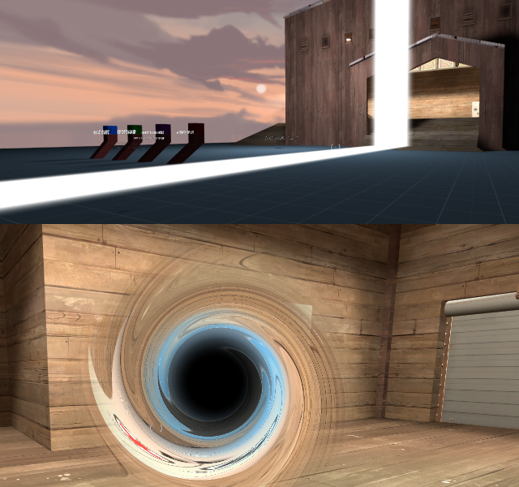
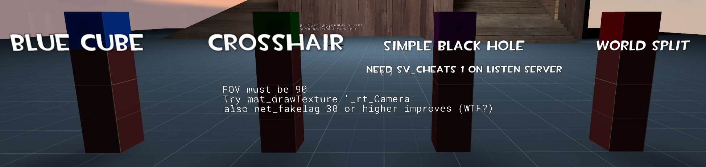
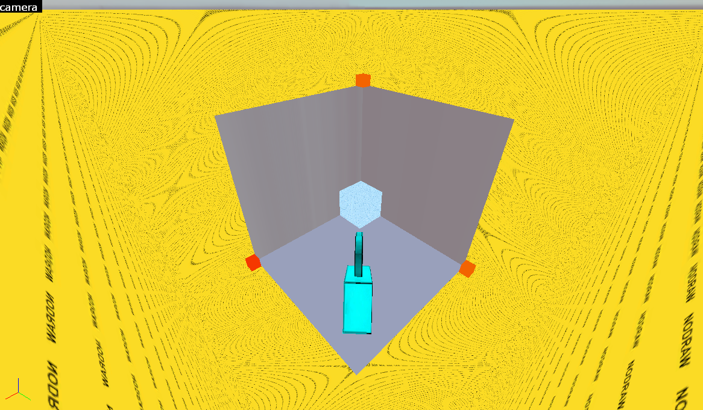
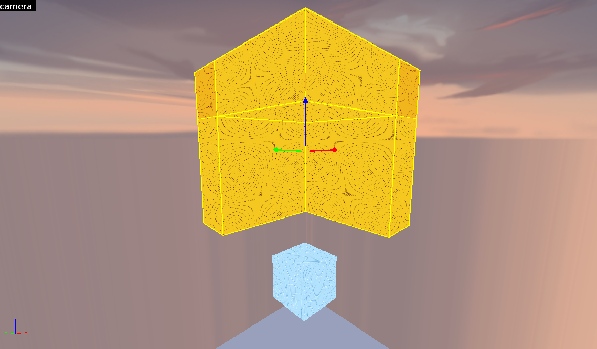
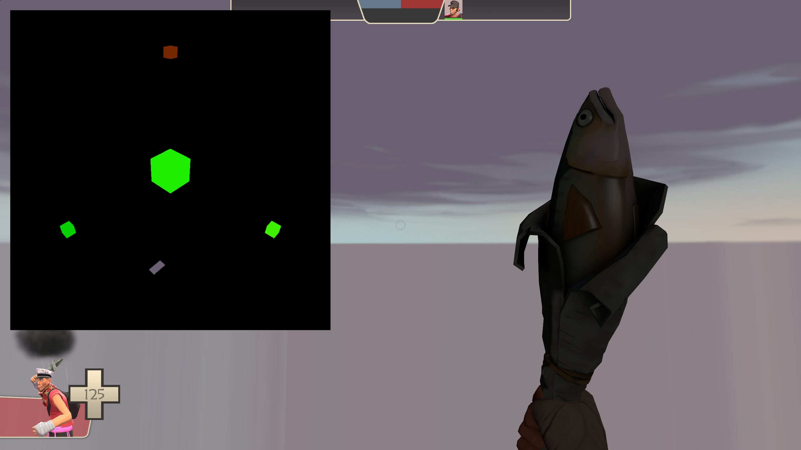

# Advanced sdk_screenspace_shaders
Extends the sdk_screenspace_shaders repository with some advanced examples. This may be TF2 only.

This has some more advanced examples including recovery of player eye angles to allow for 3D world-positioned and animated effects.

### [Demo Video: Click here](https://www.youtube.com/watch?v=uHPn7UBUuuw)

[](https://www.youtube.com/watch?v=uHPn7UBUuuw)

## Background
Read the [original repository](https://github.com/ficool2/sdk_screenspace_shaders) first.

## Map Overview
The map `demo_advanced_shaders.bsp` (in GitHub releases) has 4 buttons as shown below:


### Summary
* **Blue Cube**: An animated blue cube with bloom, 1 pass.
* **Crosshair**: A crosshair to show point stability. Increase your ping with `net_fakelag` to make it more stable, for some reason.
* **Simple Black Hole**: 2-pass shader that draws a black hole on top of the animated cube and distorts your view.
* **World Split**: 1 pass shader that literally splits the world.


### Known Limitations
* Mouse movement causes a tracking lag on very high FPS with very low ping. Increase ping (20-30+) or lower FPS
* Firing certain guns like Scout scattergun "jolts" the camera, this is not accounted for
* Crouching causes snapping (can be worked around but unimplemented)
* Motion blur or view bobbing may cause unintended side effects

### How-to
You should be able to reverse engineer the files in this repository to figure out how to recreate them, but here's an overview.

* Eye angle recovery is done via a very large devbox with a `point_camera` and 4 specially placed and textured cubes. Scroll down for info. This needs to "surround" your map - or at least the bits where you want to recover eye angles (boss arena).
* Player position is recovered via a proxy in the VMT directly and some Clamp proxies to put them into individual registers. Check `materials/effects/tracking_decode_cross_marker.vmt`.
* Then there's some code you can copy from `tracking_decode_cross_marker_ps2x.hlsl` to recover a screen position of an arbitrary point in world space via `_rt_Camera` binding.
* You need a `func_monitor` or `info_camera_link` entity "drawn" on-screen. It can be a 1x1 texture occluded by a floor or wall or func_detail. Otherwise _rt_Camera won't draw, or won't update if you step outside the draw zone of `func_monitor`.
* To control material parameters from vScript, you need a `material_modify_control` set up, anchored (parent) to a func_brush with the same screenspace shader VMT, located in the `point_camera` devbox.
- `material_modify_control` only updates when it's "in view" of either the main camera or the `point_camera`. The "material to modify" reference however is global - so when it updates on the brush, it'll update in your screenshader too.
* Set a static FOV, it's something that you can't easily "calculate" from a shader. Technically, it is possible to retrieve a player's FOV in vScript, and pass it through player-specific fog colors into the `point_camera` (TODO). But vScript should be able to set FOV. In the map, point_clientcommand is used, but `SERVER_CAN_EXECUTE prevented server running command: fov_desired` can happen.
* To stack shaders use both clientcommand `r_screenoverlay` as your first pass and `SetScriptOverlayMaterial` as the second. You can write to the framebuffer in the first pass and decode that information in the second to save information between passes. The cube->black hole demo does this by using 3 pixels in the top left of your screen to pass information to a second pass. This gets around sm2b limitations.
* Not sure how this'll perform in the real world with jitter etc. Strangely, there's a good bit of lag with 0 ping, but `net_fakelag 30` or having 30+ ping makes it rock stable.


## How it works
Shaders can access data from proxies in the [list of material proxies](https://developer.valvesoftware.com/wiki/List_of_material_proxies). These are bound at runtime and are one-way CPU->GPU. 

You'll note there's a `PlayerPosition` proxy which allows the shader to access the player's world position. Great.

There's no `PlayerAngles` though, so we can't recover the player's view matrix to draw cool things at arbitrary world positions. No space-warping black holes that follow a boss around an arena without a workaround.

### PlayerView
Instead there's `PlayerView` which returns a single scalar: A dot product of the player's view angle and the relative origin of the material's entity.

In a screenspace shader, the bound entity is going to be either null or the player, giving us no useful information on PlayerView.

But even if it did work in screenspace - it returns a single scalar value - not a `[pitch, yaw]` tuple or `[x, y, z]` vector.

However, we can also put a `screenspace_general` material on brushes. With a special shader, we can encode the result of `PlayerView` onto the color of a brush itself.

What we then have is a brush that changes color depending on if you're looking directly at it or directly away from it. 

Look straight at it: White. Look away from it: Black. 

Any angle in between: Shades of gray. (In reality, we encode in two color channels to have 16 bits of resolution)

With three of these along `+X`, `+Y`, and `+Z`, surrounding the playspace, you now have a measurement of "how much the player is looking down each axis". These are our "anchors". From this, we can recover player pitch and yaw.

But this requires the player to have all three "anchors" in view, and for us to know where they are located in the screenspace shader in order to read their color - a circular dependency.

## point_camera
[point_camera](https://developer.valvesoftware.com/wiki/Point_camera) is an entity that dates back to Half Life 2 and is used to show Dr. Breen at the very start of the game. It's used everywhere in Valve games where there's a TV screen or computer monitor.

It renders to a second framebuffer called `_rt_Camera`. Crucially, it's independent of the player - it's a static camera you can put anywhere in your map to "film" whatever you want. It won't move when the player moves.

Some maps use `point_camera` to render custom minimaps. There's a lot of clever uses for a second framebuffer.

It's also a great vector for passing server vScript information to a screenspace shader too. Simply toggle something the camera can see, and you have that information in the shader.

 (With player-specific env_fog_controllers, this can even be 24-bits of player-specific information via the fog color. This was tried originally to encode view angles directly, but you end up with a delay of the player's ping versus where they're really looking. You'll lose the ability to use fog in the map normally, though.)

Even more crucially, material proxies like `PlayerView` **still use the player's view angles** rather than the `point_camera`'s, even when being rendered by the camera.

So, we'll set up a giant box (the demo is 8000x8000x8000) around our playspace, pop four special `PlayerView` brushes in the box, and a `point_camera` to record it.

The playspace is inside the skybox in the image below. The red and yellow boxes are our special brushes (fourth is hidden, but would block the view of the skybox).




In reality, there's actually 4 brushes (for reasons to be explained later), and the giant nodraw is shaped so we can see all 4 brushes without encapsulating the actual playspace itself.

Now, here's what we (and the shader) sees in `_rt_Camera`:


If we move our mouse around and look somewhere else, the four boxes change color.

Here's our four boxes' world positions (+X, +Y, +Z, and the diagonal +XYZ):
```
A1 = (8000,    0,    0)
A2 = (   0, 8000,    0)
A3 = (   0,    0, 8000)
A4 = (8000, 8000, 8000)
```

The playspace is centered around 0,0,0.

Of course, if your map is larger than 16,000 units wide, you can place these boxes at further distances.

We can bind `_rt_Camera` into our screenspace shader, read those colors (at fixed positions), and do some maths to recover our pitch and yaw.

Each color is encoding the dot product of the player's forward vector (that we're trying to find) and `Dᵢ = normalize(Aᵢ − P)`: a normalized direction from the player to the anchor `i`.

Why four boxes instead of three? Three boxes gives us three equations for three unknowns. However, if there's any error at all in our readings (float precision, quantisation error, etc), or the player stands on an axis where two anchors become collinear, the system becomes unsolvable.

A fourth box overdetermines the system - gives it redundancy - and least-squares averages out the error across all four measurements.

## Angle recovery

All four boxes give us a set of simultaneous equations:
```cpp
c₁ = dot(f, D₁)
c₂ = dot(f, D₂)
c₃ = dot(f, D₃)
c₄ = dot(f, D₄)
```

Where:
- `f` = camera forward vector (the unknown we're solving for)
- `Dᵢ = normalize(Aᵢ − P)` = unit direction from the player to the anchor (known, because we know the player position and the anchor position)
- `cᵢ` = measured cosine from the texture (known)

We now have four equations for three unknowns (`f.x, f.y, f.z`).

Least-squares minimises the total squared error across all four measurements. We end up with a simple 3x3 linear system that is always solvable:

```
M · f = b
```

Where **M** = `DᵀD`, a 3x3 matrix built from the known anchor directions, and **b** = `Dᵀc`.

To recover `f` (our view angles):
```
M⁻¹· M · f = M⁻¹ · b
f = M⁻¹ · b
 ```

The next step is generally to ask your favorite LLM to implement the matrix reciprocal and matrix determinant calculations in HLSL for you.

This gives us a vector `f`, which is the player's forward vector. Recover pitch and yaw in a shader via:
```
f.x = cos(pitch) · cos(yaw)
f.y = cos(pitch) · sin(yaw)
f.z = sin(pitch)

therefore

yaw = atan2(f.y, f.x)
pitch = asin(f.z)
```

It's recommended to use the forward vector directly instead of the angles, as `atan2()` goes to infinity at pitch `+-90`.